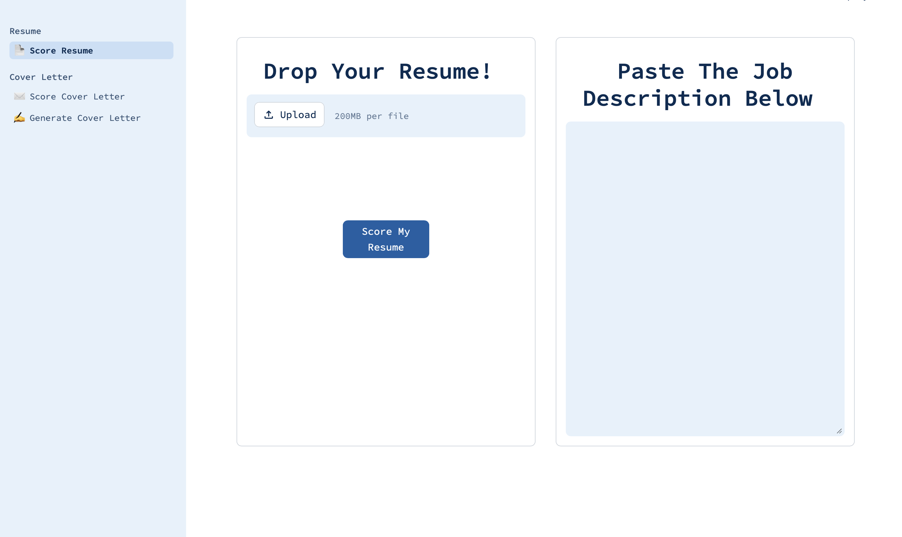
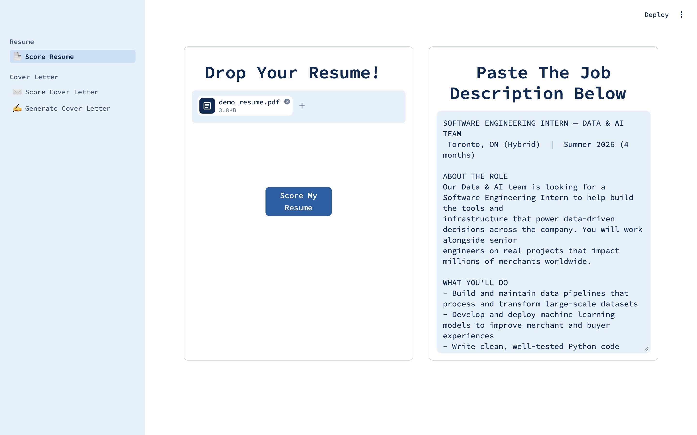
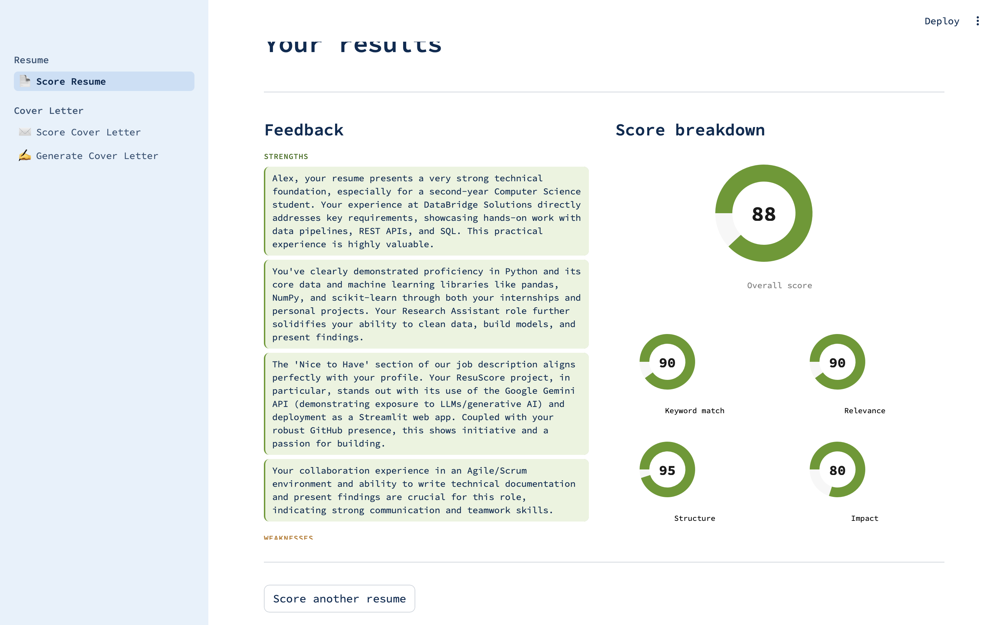

# ResuScore 🎯

An AI-powered resume analysis tool that scores your resume against any job description, provides personalized feedback, and generates tailored cover letters — built with Python, Gemini AI, and Streamlit.

🔗 **[Live Demo →](https://resuscore-yawtz55miqzs6ltkrwbtzp.streamlit.app)** &nbsp;|&nbsp; ⭐ Star this repo if you find it useful

---



---

## What it does

ResuScore analyzes your resume against a specific job description and gives you actionable, personalized feedback — the same way a real recruiter would review it.

- **Resume Scoring** — scores your resume 0–100 across 4 dimensions: keyword match, relevance, structure, and impact
- **Resume Feedback** — detailed strengths, weaknesses, missing keywords, and specific before/after bullet point rewrites
- **Cover Letter Scoring** — scores your cover letter across personalization, relevance, tone, and structure
- **Cover Letter Generation** — generates a tailored, professional 3-paragraph cover letter based on your resume and the job description

---

## Demo

| Upload Page | Results Page |
|---|---|
|  |  |

---

## Tech stack

| Layer | Tool |
|---|---|
| Language | Python 3.12 |
| AI model | Google Gemini 2.0 Flash Lite |
| AI library | google-genai |
| PDF parsing | pdfplumber |
| Frontend | Streamlit |
| Deployment | Streamlit Cloud |
| Version control | Git + GitHub |

---

## How it works

```
Upload PDF resume + paste job description
            ↓
pdfplumber extracts raw text from PDF
            ↓
Gemini analyzes resume against job description
            ↓
Scores and feedback returned as structured JSON
            ↓
Results displayed in a two-column dashboard
```

---

## Getting started

### Prerequisites
- Python 3.10 or higher
- A Google Gemini API key (free at [aistudio.google.com](https://aistudio.google.com))

### Installation

1. Clone the repository
```bash
git clone https://github.com/yourusername/ResuScore.git
cd ResuScore
```

2. Create and activate a virtual environment
```bash
python3 -m venv venv
source venv/bin/activate        # Mac/Linux
venv\Scripts\activate           # Windows
```

3. Install dependencies
```bash
pip install -r requirements.txt
```

4. Create a `.env` file in the root folder
```
GEMINI_API_KEY=your_api_key_here
```

5. Run the app
```bash
streamlit run user_interface.py
```

The app will open at `http://localhost:8501`

---

## Project structure

```
ResuScore/
│
├── pages/
│   ├── generate_letter.py    ← Cover letter generation page
│   ├── letter_score.py       ← Cover letter scoring page
│   └── resume.py             ← Resume scoring and feedback page
│
├── .streamlit/
│   └── config.toml           ← Streamlit theme configuration
│
├── src/                      ← Source utilities
├── data/                     ← Sample resumes for testing
│
├── user_interface.py         ← Main Streamlit app entry point
├── API_calls.py              ← All Gemini API prompt functions
├── parser.py                 ← JSON parsing and cleaning utilities
├── additional_functions.py   ← Shared helper functions
├── test.py                   ← API key setup and connection test
├── requirements.txt          ← All pip dependencies
├── .env                      ← Your API key (never committed to GitHub)
├── .gitignore                ← Ignores .env and venv
└── README.md                 ← You are here
```

---

## Features in detail

### Resume scoring
Scores the resume across 4 dimensions using semantic analysis — not just simple keyword matching. Gemini reads the resume the way a recruiter would, understanding context and relevance.

### Personalized feedback
Feedback is cross-referenced between the resume and the job description. Every suggestion references specific lines from the resume and specific requirements from the job description — no generic advice.

### Cover letter generation
Generates a 3-paragraph cover letter using only experience and skills that exist in the resume. Gemini is explicitly instructed not to invent achievements, keeping the output honest and accurate.

---

## Roadmap

- [ ] LinkedIn bio generator
- [ ] Interview question predictor based on job description
- [ ] Support for multiple resume formats
- [ ] Side-by-side resume comparison

---

## Built by

**Param Khurana** — Second year CS student  
Building this project to learn AI integration, prompt engineering, and full-stack Python development.

[GitHub](https://github.com/itsmeparam.09) · [LinkedIn](www.linkedin.com/in/param-khurana)

---

## License

MIT License — feel free to use, modify, and share.
